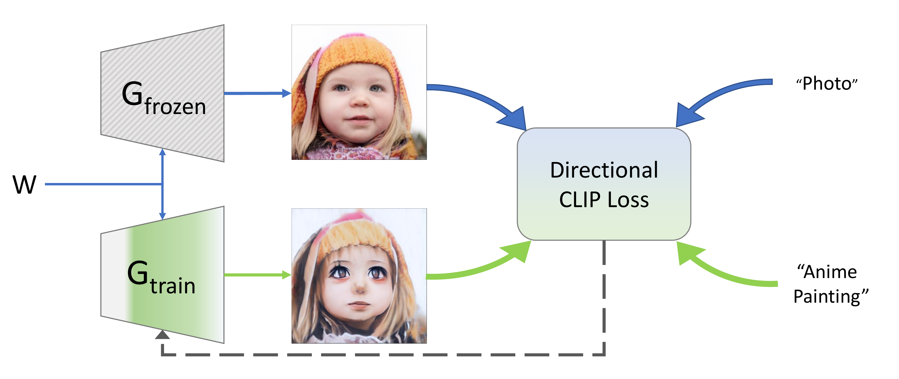

# StyleGAN-NADA: CLIP-Guided Domain Adaptation of Image Generators (SIGGRAPH 2022)

[](http://colab.research.google.com/github/rinongal/stylegan-nada/blob/main/stylegan_nada.ipynb) 
[](https://www.kaggle.com/ratthachat/stylegan-nada-playground) [](https://arxiv.org/abs/2108.00946)
[](https://www.casualganpapers.com/text-guided-clip-gan-domain-adaptation/StyleGAN-NADA-explained.html)[](https://huggingface.co/spaces/rinong/StyleGAN-NADA)

[[Project Website](https://stylegan-nada.github.io/)] [[Replicate.ai Project](https://replicate.ai/rinongal/stylegan-nada)]

> **StyleGAN-NADA: CLIP-Guided Domain Adaptation of Image Generators**<br>
> Rinon Gal, Or Patashnik, Haggai Maron, Amit H. Bermano, Gal Chechik, Daniel Cohen-Or <br>

>**Abstract**: <br>
> Can a generative model be trained to produce images from a specific domain, guided by a text prompt only, without seeing any image? In other words: can an image generator be trained blindly? Leveraging the semantic power of large scale Contrastive-Language-Image-Pre-training (CLIP) models, we present a text-driven method that allows shifting a generative model to new domains, without having to collect even a single image from those domains.
We show that through natural language prompts and a few minutes of training, our method can adapt a generator across a multitude of domains characterized by diverse styles and shapes. Notably, many of these modifications would be difficult or outright impossible to reach with existing methods.
We conduct an extensive set of experiments and comparisons across a wide range of domains. These demonstrate the effectiveness of our approach and show that our shifted models maintain the latent-space properties that make generative models appealing for downstream tasks.

## Description
This repo contains the implementation of IDE3D-NADA, a Non-Adversarial Domain Adaptation for [IDE-3D](https://mrtornado24.github.io/IDE-3D/). You can find the official code of StyleGAN-NADA [here](https://github.com/rinongal/StyleGAN-nada).

The following diagram illustrates the process:




## Generator Domain Adaptation

Here is a sample:

<p float="centered">
  
</p>

## Setup

The code relies on the official implementation of [CLIP](https://github.com/openai/CLIP), 
and the [Rosinality](https://github.com/rosinality/stylegan2-pytorch/) pytorch implementation of StyleGAN2.

### Requirements
- Anaconda
- Pretrained StyleGAN2 generator (can be downloaded from [here](https://drive.google.com/file/d/1EM87UquaoQmk17Q8d5kYIAHqu0dkYqdT/view?usp=sharing)). You can also download a model from [here](https://github.com/NVlabs/stylegan2-ada) and convert it with the provited script. See the colab notebook for examples.

In addition, run the following commands:
  ```shell script
conda install --yes -c pytorch pytorch=1.7.1 torchvision cudatoolkit=<CUDA_VERSION>
pip install ftfy regex tqdm
pip install git+https://github.com/openai/CLIP.git
```

### Usage

To convert a generator from one domain to another, use the colab notebook or run the training script in the ZSSGAN directory:

```
python train.py --size 512
                --batch 2 
                --n_sample 4 
                --output_dir /path/to/output/dir 
                --lr 0.002 
                --frozen_gen_ckpt /path/to/pretrained_ide3d.pkl 
                --iter 301 
                --source_class "Photo" 
                --target_class "3D Render in the Style of Pixar" 
                --auto_layer_k 18
                --auto_layer_iters 1 
                --auto_layer_batch 8 
                --output_interval 50 
                --clip_models "ViT-B/32" "ViT-B/16" 
                --clip_model_weights 1.0 1.0 
                --mixing 0.0
                --save_interval 100
                --ide3d
```

Where you should adjust size to match the size of the pre-trained model, and the source_class and target_class descriptions control the direction of change.
For an explenation of each argument (and a few additional options), please consult ZSSGAN/options/train_options.py. For most modifications these default parameters should be good enough. See the colab notebook for more detailed directions.

**21/08/2021** Instead of using source and target texts, you can now target a style represented by a few images. Simply replace the `--source_class` and `--target_class` options with:

```
--style_img_dir /path/to/img/dir
```
where the directory should contain a few images (png, jpg or jpeg) with the style you want to mimic. There is no need to normalize or preprocess the images in any form.

## Pre-Trained Models

We will add some pretrained models soon.

## Docker

We now provide a simple dockerized interface for training models.
The UI currently supports a subset of the colab options, but does not require repeated setups.

In order to use the docker version, you must have a CUDA compatible GPU and must install [nvidia-docker](https://github.com/NVIDIA/nvidia-docker) and [docker-compose](https://docs.docker.com/compose/install/) first.

After cloning the repo, simply run:
```
cd StyleGAN-nada/
docker-compose up
```

* Downloading the docker for the first time may take a few minutes.
* While the docker is running, the UI should be available under http://localhost:8888/
* The UI was tested using an RTX3080 GPU with 16GB of RAM. Smaller GPUs may run into memory limits with large models.

If you find the UI useful and want it expended to allow easier access to saved models, support for real image editing etc., please let us know.

## 3D-Aware face editing

Since the adpated model shares the same latent space with the original IDE3D model, it supports 3D-Aware face editing. You can replace the original model path to the apdated one and run the ui following [instructions](https://github.com/MrTornado24/IDE-3D). Here is a sample:


<p float="centered">
  
</p>

## Render images and videos

### Render images
```
python gen_images.py
        --network /path/to/apdated_ide3d.pkl
        --seeds 58,96,174,180,179,185 
        --trunc 0.7 
        --outdir out
```

### Render videos
```
python gen_videos.py 
    --network /path/to/apdated_ide3d.pkl 
    --seeds 58,96,174,180,179,185 
    --grid 3x2 
    --trunc 0.7 
    --outdir out 
    --image_mode image_seg 
```
    
## Citation

If you make use of our work, please cite the following papers:

```
@article{sun2022ide,
  title={IDE-3D: Interactive Disentangled Editing for High-Resolution 3D-aware Portrait Synthesis},
  author={Sun, Jingxiang and Wang, Xuan and Shi, Yichun and Wang, Lizhen and Wang, Jue and Liu, Yebin},
  journal={arXiv preprint arXiv:2205.15517},
  year={2022}
}

@inproceedings{sun2021fenerf,
  title={FENeRF: Face Editing in Neural Radiance Fields},
  author={Sun, Jingxiang and Wang, Xuan and Zhang, Yong and Li, Xiaoyu and Zhang, Qi and Liu, Yebin and Wang, Jue},
  booktitle = {Proceedings of the IEEE Conference on Computer Vision and Pattern Recognition (CVPR)},
  year={2022}
}

@misc{gal2021stylegannada,
      title={StyleGAN-NADA: CLIP-Guided Domain Adaptation of Image Generators}, 
      author={Rinon Gal and Or Patashnik and Haggai Maron and Gal Chechik and Daniel Cohen-Or},
      year={2021},
      eprint={2108.00946},
      archivePrefix={arXiv},
      primaryClass={cs.CV}
}
```
